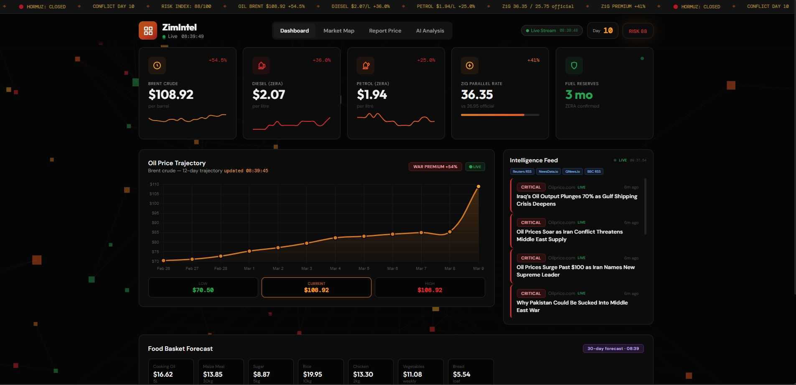

# ZimIntel - Real-Time Market Intelligence for Zimbabwe

<p align="center">
  
</p>

**ZimIntel** is a full-stack, real-time economic intelligence platform that tracks fuel prices, currency movements, food basket costs, and geopolitical risk across 17 Zimbabwean cities. It combines live oil market data, crowdsourced price reports, and AI-powered game theory analysis to help citizens, businesses, and policymakers navigate economic volatility.

> Built as a solo project. One backend. One frontend. Zero frameworks. Real-time everything.

---

## Live Demo

**Deployed on Render** -- SSE-optimised with gthread workers for persistent streaming.

---

## What It Does

Zimbabwe faces compounding economic pressures: global oil shocks from the Strait of Hormuz crisis, a volatile ZiG currency with a 40%+ parallel market premium, and cascading food price inflation. ZimIntel turns chaos into clarity:

| Capability | Detail |
|---|---|
| **Real-Time Price Streaming** | Brent crude, diesel, petrol, and ZiG rates streamed via SSE every 3 seconds |
| **Interactive Market Map** | 17 cities with live fuel/currency prices on a Mapbox GL map with click-through detail popups |
| **AI Market Analysis** | Claude-powered game theory with Monte Carlo simulations, Nash equilibrium predictions, and Bayesian price forecasting |
| **Food Basket Forecast** | 8-item basket dynamically recalculated from oil price pass-through models |
| **Crowdsourced Reporting** | Citizens submit local prices that blend into city averages via exponential smoothing |
| **Live Intelligence Feed** | Aggregated from Reuters, BBC, OilPrice.com, NewsData.io, and GNews RSS feeds |
| **Risk Scoring** | Composite 0-100 index driven by oil deviation, currency premium, and conflict escalation |

---

## How It Works

### Dashboard -- Live Price Cards, Oil Trajectory, Intelligence Feed & Food Basket


The main dashboard streams Brent crude, diesel (ZERA), petrol, ZiG parallel rate, and fuel reserves via Server-Sent Events. The oil price trajectory chart shows a 12-day history with war premium indicators. A live intelligence feed aggregates breaking news from 4+ RSS sources. The food basket forecast tracks 8 essential items with 30-day price projections.

---

### Market Map -- City-Level Price Intelligence


An interactive Mapbox GL JS map plots all 17 tracked cities with colour-coded markers (red = above average, amber = average, green = below average). Marker size scales with community report count. The city grid below shows ZiG rate and fuel prices at a glance.

---

### Map Detail -- Click-Through City Popup


Clicking any city pin reveals ZiG rate, diesel price, petrol price, report count, and price level classification. All values update in real time as the SSE stream pushes new data.

---

### AI Analysis -- Game Theory, Monte Carlo & Nash Equilibrium


The AI analysis tab runs Claude-powered models every 2 hours: an executive summary with 8 KPI forecast boxes, Monte Carlo scenario probabilities (10,000 simulation runs), a 5-actor game theory strategy matrix (ZERA, RBZ, Importers, Retailers, Consumers), Nash equilibrium predictions, a 4-phase price transmission timeline, and actionable citizen/government recommendations. All values recalculate dynamically from live market state.

---

## Architecture

```
FRONTEND (index.html)
  Single-file HTML/CSS/JS -- Chart.js -- Mapbox GL JS -- SSE Client
                          |
                          | HTTP / SSE (3-second cadence)
                          v
BACKEND (zim-intel-api.py)
  Flask + CORS -- REST API -- SSE Streaming -- Background Threads
  |                |                |               |
  Oil Loop         News Loop        AI Loop         SSE Generator
  (5 min)          (10 min)         (2 hours)       (3 sec ticks)
  |                |                |
  v                v                v
Yahoo Finance    RSS Feeds        Anthropic API
(Brent Crude)    (Reuters/BBC)    (Claude)
```

**Key architectural decisions:**
- **Single HTML file** -- Zero build step. No webpack, no bundlers. Ship and serve.
- **SSE over WebSockets** -- Unidirectional price streaming. Simpler, auto-reconnects, works through proxies. Server pushes every 3 seconds with a heartbeat/watchdog pattern.
- **gthread workers** -- Gunicorn with OS-level threads for SSE. Each connection gets a dedicated thread without monkey-patching (no gevent).
- **Pass-through economic model** -- When oil moves, diesel (55%), petrol (50%), ZiG (25%), and all 17 city prices recalculate proportionally from baselines.
- **Polling fallback** -- If SSE disconnects, the frontend silently falls back to 6-second REST polling with automatic reconnection attempts.

---

## Tech Stack

| Layer | Technology |
|---|---|
| **Frontend** | Vanilla JS, CSS3 (custom properties, grid, animations), Chart.js, Mapbox GL JS |
| **Backend** | Python 3, Flask, Flask-CORS, Gunicorn (gthread) |
| **Data Sources** | Yahoo Finance API (yfinance), Reuters RSS, BBC RSS, OilPrice.com, NewsData.io, GNews |
| **AI/ML** | Anthropic Claude API (game theory, Monte Carlo, Bayesian forecasting) |
| **Streaming** | Server-Sent Events (SSE) with heartbeat, watchdog, and stale detection |
| **Map** | Mapbox GL JS with GeoJSON layers, dynamic markers, and interactive popups |
| **Deployment** | Render (web service), Gunicorn with gthread workers, zero-timeout for SSE |

---

## API Endpoints

| Method | Endpoint | Description |
|---|---|---|
| `GET` | `/api/market` | Current market state (brent, diesel, petrol, ZiG, risk, conflict day) |
| `GET` | `/api/cities` | All 17 cities with live prices, coordinates, and price levels |
| `GET` | `/api/news` | Latest aggregated news from RSS feeds |
| `GET` | `/api/food-basket` | 8-item food basket with current prices and 30-day forecasts |
| `GET` | `/api/analysis` | AI-generated market analysis (game theory, scenarios, recommendations) |
| `GET` | `/api/oil-history` | Brent crude price history for chart rendering |
| `POST` | `/api/contribute` | Submit crowdsourced price report (city, category, value) |
| `GET` | `/stream` | SSE endpoint -- persistent connection streaming all market data |

---

## Economic Models

### Oil Price Pass-Through
```
Brent crude change --> Diesel: 55% pass-through (landed cost + refining + margin)
                   --> Petrol: 50% pass-through
                   --> ZiG pressure: 25% of oil % change (import cost pressure)
                   --> Risk index: scales with oil deviation from baseline
                   --> City prices: proportional adjustment across all 17 cities
                   --> Food basket: 40% current, 55% forecast pass-through
```

### Game Theory (5-Actor Model)
The AI analysis models Zimbabwe's fuel market as a multi-player non-cooperative game:
- **ZERA** (regulator) -- price hike probability driven by oil deviation
- **RBZ** (central bank) -- intervention probability based on ZiG premium
- **Importers** -- margin strategy responding to forex pressure
- **Retailers** -- pass-through probability scaling with hike expectations
- **Consumers** -- demand destruction driven by price and premium levels

### Monte Carlo Simulation
10,000 runs per analysis cycle across 4 scenarios: Hormuz Reopens, Conflict Escalates, ZERA Price Hike, and RBZ Intervention. Probabilities and impact deltas recalculate from live market state.

---

## Running Locally

```bash
# Clone the repository
git clone https://github.com/your-username/zimintel.git
cd zimintel

# Install dependencies
pip install -r requirements.txt

# Set environment variables
export ANTHROPIC_API_KEY=your_key_here   # Required for AI analysis

# Run with Flask dev server
python zim-intel-api.py

# Or run with Gunicorn (production)
gunicorn -c gunicorn.conf.py --timeout 0 --worker-class gthread --threads 4 zim-intel-api:app
```

Open `http://localhost:5000` in your browser.

---

## Project Structure

```
zimintel/
  index.html              # Complete frontend (HTML + CSS + JS, ~2400 lines)
  zim-intel-api.py        # Flask backend (API + SSE + background threads, ~1200 lines)
  zimintel-data.json      # Persistent storage for community reports
  gunicorn.conf.py        # SSE-optimised Gunicorn configuration
  requirements.txt        # Python dependencies
  Procfile                # Render deployment config
  ZIMINTEL_CONTEXT.md     # Detailed economic models & data schemas
  src/
    Dashboard.JPG         # Dashboard screenshot
    zim-market-map.JPG    # Market map screenshot
    mapbox-with componet click of a pin.JPG  # City popup screenshot
    ai-analysis.JPG       # AI analysis screenshot
```

---

## What I Learned Building This

- **SSE is underrated** -- For unidirectional real-time data, SSE is simpler than WebSockets, auto-reconnects natively, and works through corporate proxies. The 3-second cadence with heartbeat/watchdog was the sweet spot for live-feeling updates without overwhelming the client.
- **Economic modelling in a web app** -- Pass-through ratios, exponential smoothing for crowdsourced data, and game theory actor matrices turned a price tracker into an intelligence platform.
- **Single-file frontends still work** -- No React, no build step, no node_modules. Vanilla JS with CSS custom properties and modern browser APIs (SSE, IntersectionObserver, requestAnimationFrame) can deliver a polished, responsive experience.
- **Gunicorn threading matters for SSE** -- The gthread worker class with `timeout=0` was essential. Default 30-second timeouts kill SSE connections silently.

---

## License

MIT

---

*Built by Spencer Chakabva*
